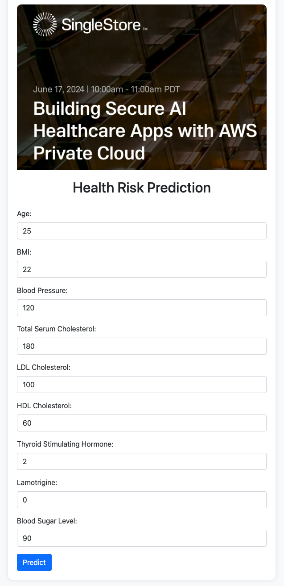

# Healthcare Chatbot with Diabetes Risk Prediction

This project is a simple web-based healthcare chatbot application that predicts the risk of diabetes based on user input. The application uses a machine learning model to provide predictions.

## Features

- Interactive web form to input health-related parameters.
- Predicts diabetes risk based on the input data.
- Utilizes Flask for the backend and a machine learning model for predictions.
- Scalable and customizable for different healthcare use cases.

## Prerequisites

- Python 3.9 or higher
- Flask
- Scikit-learn
- Joblib
- Numpy
- Pandas

## Installation

1. Clone the repository:
    ```bash
    git clone https://github.com/your-username/HealthCareChatbot.git
    cd HealthCareChatbot
    ```

2. Create and activate a virtual environment:
    ```bash
    python3 -m venv venv
    source venv/bin/activate  # On Windows, use `venv\Scripts\activate`
    ```

3. Install the required packages:
    ```bash
    pip install -r requirements.txt
    ```

4. Train the model and save it:
    ```bash
    python train_model.py
    ```

## Usage

1. Run the Flask application:
    ```bash
    python app.py
    ```

2. Open your web browser and go to `http://127.0.0.1:5001` to access the web application.

## File Structure

- `app.py`: The Flask application file that handles API requests and serves the web application.
- `train_model.py`: Script to train the machine learning model and save it as a `model.pkl` file.
- `index.html`: The front-end HTML file that provides the user interface.
- `requirements.txt`: List of required Python packages.

## How It Works

1. The user inputs their health parameters (age, BMI, blood pressure, cholesterol levels, etc.) into the web form.
2. The data is sent to the Flask backend via a POST request.
3. The backend processes the input data, scales it using the pre-trained scaler, and makes a prediction using the pre-trained machine learning model.
4. The prediction (diabetes risk level) is returned to the user and displayed on the web interface.

## Screenshots



## Contributing

Feel free to contribute to this project by submitting issues or pull requests.

## License

This project is licensed under the MIT License. See the `LICENSE` file for more details.

## Acknowledgements

- [Flask](https://flask.palletsprojects.com/)
- [Scikit-learn](https://scikit-learn.org/)
- [Bootstrap](https://getbootstrap.com/)


